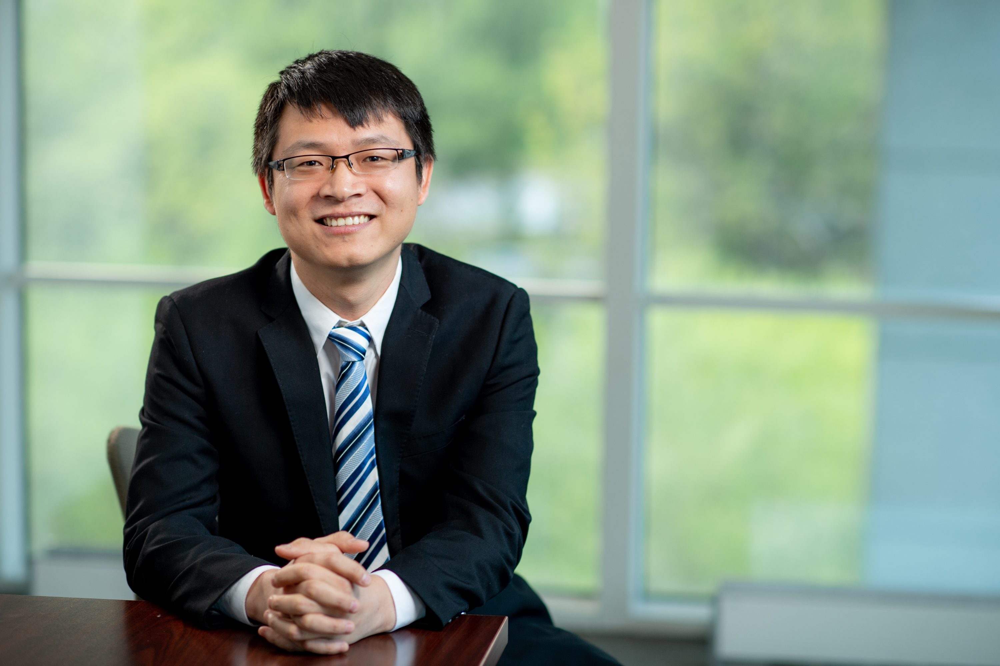

<link rel="stylesheet" href="styles.css" type="text/css">

I am a research scientist at Boston University School of Public Health. My primary research focuses on estimating the impacts of extreme weather events and built environment risk factors, such as air pollution, light pollution, and greenness space, on human health across the life course, especially for susceptible subgroups of the fetus, children, and elderly. Prior to Boston University, I was a postdoctoral research associate at Brown University School of Public Health. I received a PhD in epidemiology and biostatistics from the University of Hong Kong (2017) and earned a MPhil in Environmental Health from Peking University (2013).

&nbsp; [Curriculum Vitae](CV_Shengzhi Sun.pdf)      
&nbsp; [Google Scholar](https://scholar.google.com.hk/citations?hl=en&user=R0S2h00AAAAJ&view_op=list_works&sortby=pubdate)    
&nbsp;&nbsp;  [Researchgate](https://www.researchgate.net/profile/Shengzhi_Sun)     
&nbsp;  &nbsp;[Publons](https://publons.com/researcher/1639866/shengzhi-sun/)         
 [ORCID](https://orcid.org/0000-0002-3708-1225)
